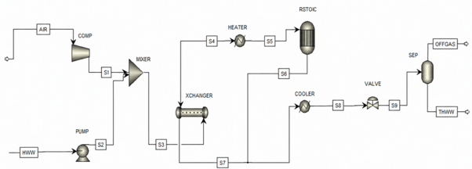
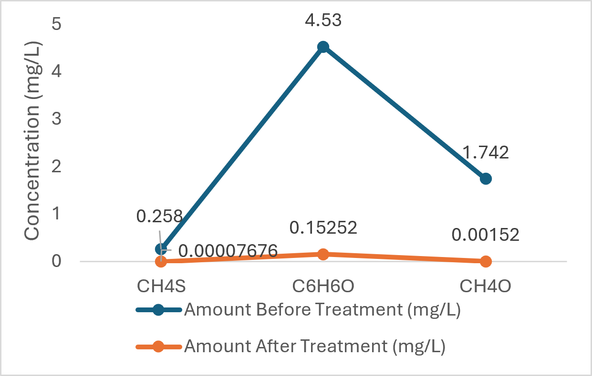
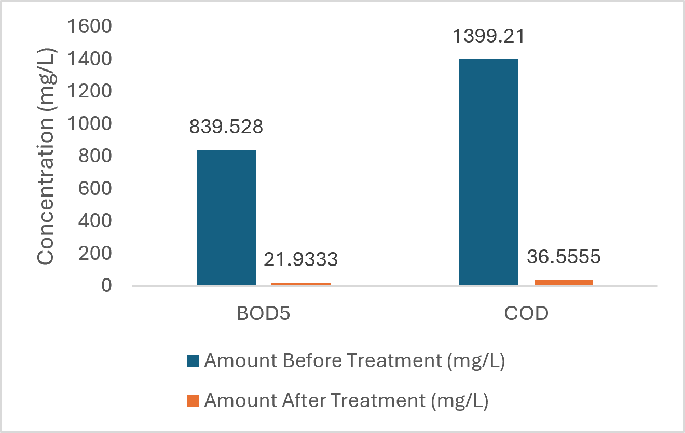

# Wet Air Oxidation for Hospital Wastewater Treatment
### Performance Evaluation of the Wet-Air Oxidation (WAO) Method for the Treatment of Hospital Wastewater (A Case Study)

---

## Project Overview

Hospital wastewater (HWW) is one of the most hazardous effluent streams in any urban environment, carrying pathogens, pharmaceuticals, heavy metals, and toxic organic compounds that pose serious risks to public health and aquatic ecosystems when discharged untreated. In Nigeria, where dedicated hospital wastewater treatment infrastructure is limited, this problem is acute.

This project evaluated the effectiveness of the Wet Air Oxidation (WAO) process for treating wastewater collected from one of the hospitals in Rivers State, Nigeria,  using physicochemical analysis and Aspen Plus process simulation.

---

## The Problem

Physicochemical analysis of the untreated wastewater revealed high concentrations of key contaminants:

| Contaminant | Concentration (mg/L) | WHO Standard (mg/L) |
|---|---|---|
| Methanethiol (CH₄S) | 0.258 | — |
| Phenol (C₆H₆O) | 4.53 | — |
| Methanol (CH₄O) | 1.742 | — |
| BOD₅ | 839.53 | 50 |
| COD | 1,399.21 | 60 |

Both BOD₅ and COD were approximately 16–23x above WHO effluent discharge limits, confirming that direct discharge of this wastewater could pose severe environmental and public health consequences.

---

## Aim

To evaluate the performance of the Wet Air Oxidation method in treating hospital wastewater, determine optimal operating conditions, and confirm compliance with WHO effluent discharge standards.

---

## Tools Used

| Tool | Purpose |
|---|---|
| **Aspen Plus V11** | WAO process simulation and sensitivity analysis |
| **SRK thermodynamic model** | Vapour-liquid equilibrium property calculations |
| **Microsoft Excel** | Data organisation and results visualization |
| **Laboratory instruments** | BOD analyser, COD analyser, spectrophotometer, mercaptan gas detector |

---

## Methodology

**Phase 1 — Physicochemical Analysis**
Wastewater samples were collected from the hospital's discharge points via grab sampling. Five key contaminants were measured: BOD₅, COD, methanethiol, phenol, and methanol using standard laboratory procedures.

**Phase 2 — Aspen Plus Simulation**
The WAO process was simulated using Aspen Plus V11. Key equipment modelled included a pump, compressor, mixer, heat exchanger, reactor, heater, cooler, valve, and separator. The SRK thermodynamic model was selected for accurate vapour-liquid equilibrium calculations. The reactor was set at 320°C and 220 bar, conditions required to generate hydroxyl radicals that degrade organic pollutants.

**Phase 3 — Sensitivity Analysis**
Key process parameters were systematically varied to identify optimal operating conditions:
- Feed-to-air ratio: 1:5, 1:7, 1:9, 1:11, 1:13
- Temperature: 200°C, 250°C, 300°C
- Pressure: 100 bar, 150 bar, 200 bar

---

## Process Flow Diagram

*Figure 1: Process Flow Diagram (PFD) of the Wet Air Oxidation process simulated in Aspen Plus V11. Key equipment includes pump, compressor, mixer, heat exchanger, reactor, heater, cooler, valve, and separator.*

---

## Key Results

### Treatment Performance

| Contaminant | Before (mg/L) | After (mg/L) | Removal Efficiency |
|---|---|---|---|
| Methanethiol | 0.258 | 0.0001 | **99%** |
| Phenol | 4.53 | 0.153 | **96%** |
| Methanol | 1.742 | 0.002 | **99%** |
| BOD₅ | 839.53 | 21.93 | **97%** |
| COD | 1,399.21 | 36.56 | **97%** |

### Before vs After Treatment — HWW Constituents

*Figure 2: Comparison of HWW constituent concentrations before and after WAO treatment. All five contaminants show significant reductions following the WAO process.*

### Before vs After Treatment — BOD₅ and COD vs WHO Standards

*Figure 3: BOD₅ and COD concentrations before and after WAO treatment compared against WHO effluent discharge standards (BOD₅ ≤ 50 mg/L, COD ≤ 60 mg/L). Post-treatment values are well within the limits.*

### Optimal Operating Conditions

| Parameter | Optimal Range |
|---|---|
| Temperature | 150°C – 320°C |
| Pressure | 10 – 220 bar |
| Feed-to-air ratio | 1:9 |

The sensitivity analysis confirmed that a feed-to-air ratio of 1:9 achieves the best balance between pollutant removal efficiency and sodium sulphate formation in the off-gas.

---

## Conclusion

The WAO process, simulated in Aspen Plus, demonstrated exceptional effectiveness in treating hospital wastewater, achieving removal efficiencies of up to 99% for key contaminants and full compliance with WHO effluent discharge standards. The sensitivity analysis identified a temperature range of 150–320°C, pressure of 10–220 bar, and a feed-to-air ratio of 1:9 as the optimal operating conditions for maximum treatment efficiency.

These findings confirm that WAO is a viable, efficient, and environmentally sustainable method for hospital wastewater treatment, with direct relevance to Nigeria's healthcare waste management challenges.

---

## Authors

**Nnadi, W.¹ | Iregbu, P. O.¹ | Kenneth-Dagde, A.² | Dagde, K. K.¹**

¹Department of Chemical/Petrochemical Engineering, Rivers State University, Port Harcourt
²Department of Nursing Sciences, Rivers State University, Port Harcourt

---

## References

Tager, E., et al. (2023). Aspen Plus designing and optimizing the hospital wastewater treatment by wet air oxidation method. *E3S Web of Conferences, 436.* https://doi.org/10.1051/e3sconf/202343610012

Majumder, A., et al. (2021). A review on hospital wastewater treatment. *Journal of Environmental Chemical Engineering, 9(2), 104812.*

Brunner, G. (2014). Oxidation in High-Temperature and Supercritical Water. *Supercritical Fluid Science and Technology 5, 525–568.*

> Full research report available on request.

---

## About

**Winnie NNADI** | Chemical Engineer | Energy Process Optimization | Data Science

*"I use engineering knowledge and data science to optimize energy processes and make operations run better."*

